# Hi, I'm Arpita 👋

### Embedded Systems | Digital Design | Verilog

- 👋 Hi, I’m @arpita-developer
- 👀 I’m interested in Computer Architecture
- 🌱 I’m currently learning how to debug without questioning my life choices.
- 💞️ I’m looking to collaborate on projects involving embedded systems, Verilog/FPGA, digital design, and anything that makes hardware do cool things.
- 📫 How to reach me : arpitarautaray.code@gmail.com
- 😄 Pronouns: She/Her
- ⚡ Fun fact: I’m an ECE student, so I can explain how electrons move but still have no idea where my own motivation went.

<!---
arpita-developer/arpita-developer is a ✨ special ✨ repository because its `README.md` (this file) appears on your GitHub profile.
You can click the Preview link to take a look at your changes.
--->
